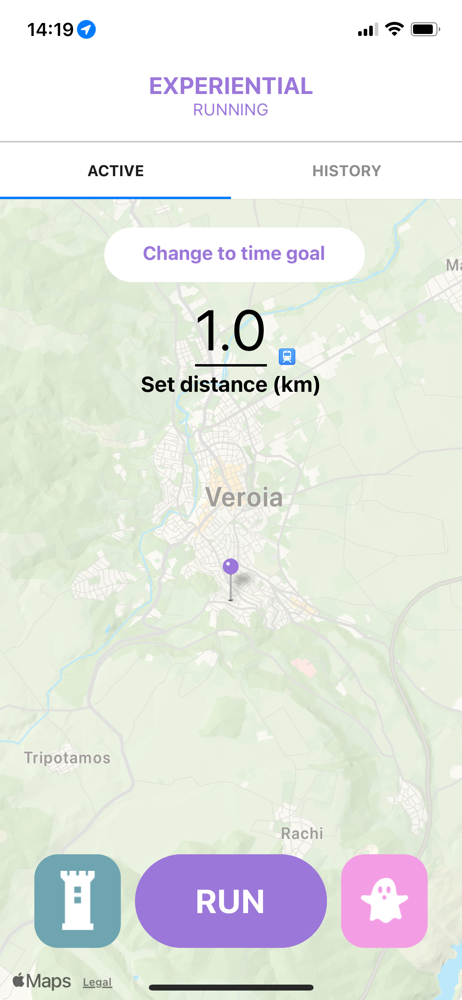

# experiential-running

This app is part of the course Cooperative IT-design at KTH.

To run it download Expo Go and run npx expo start.

Screenshots from the app:

1st: Menu, 2nd: Regular Run Initial View and 3rd: Ghost Run

    
    
    

