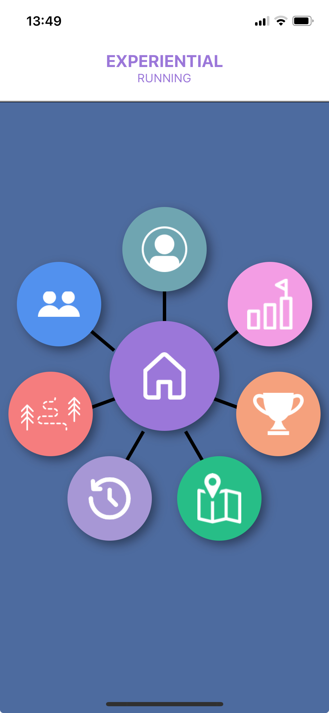
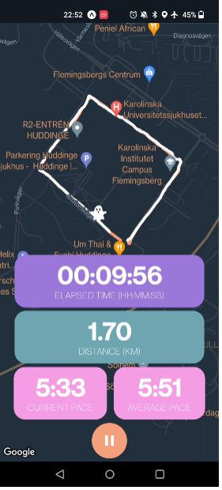

# experiential-running

This app is part of the course Cooperative IT-design at KTH.

To run it download Expo Go and run npx expo start.

Menu:

Regular run initial view:

Ghost run: Following a previous route and having the ghost "haunting you":
